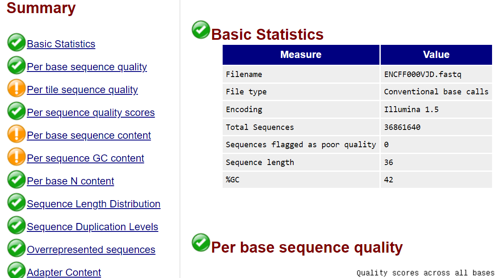
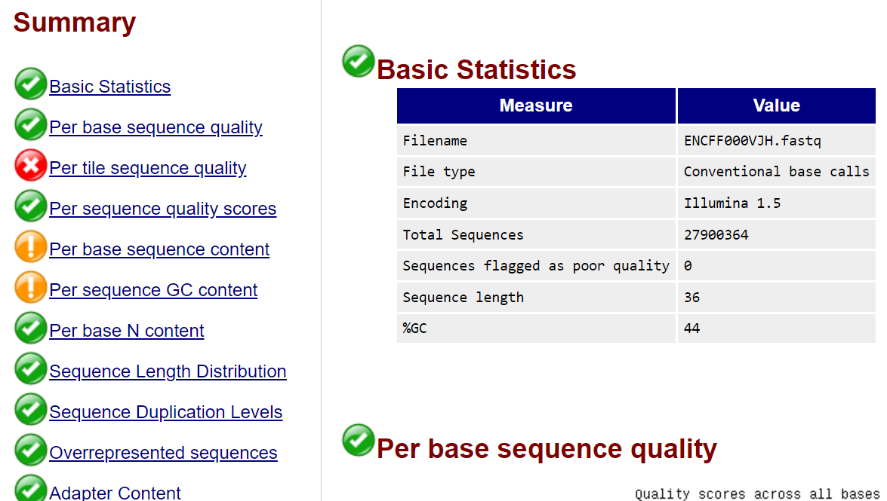
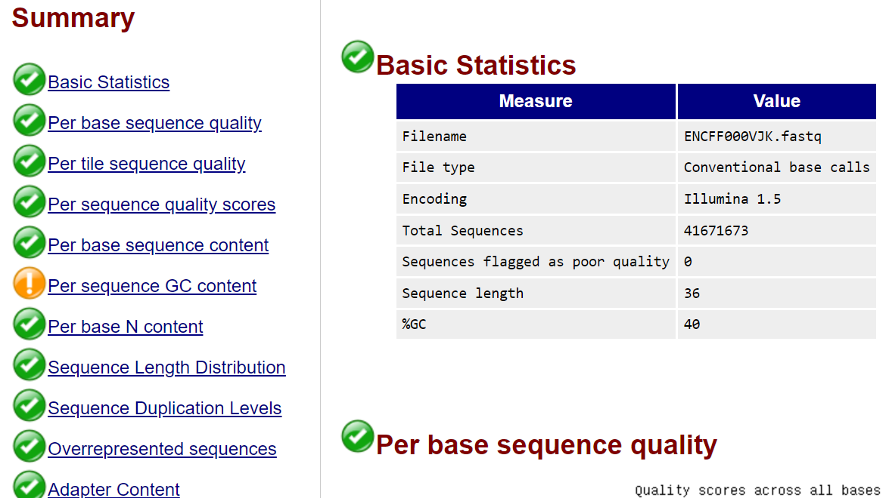
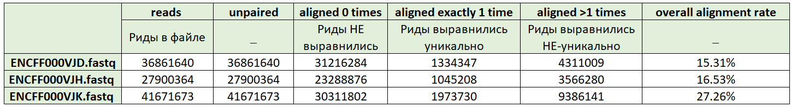
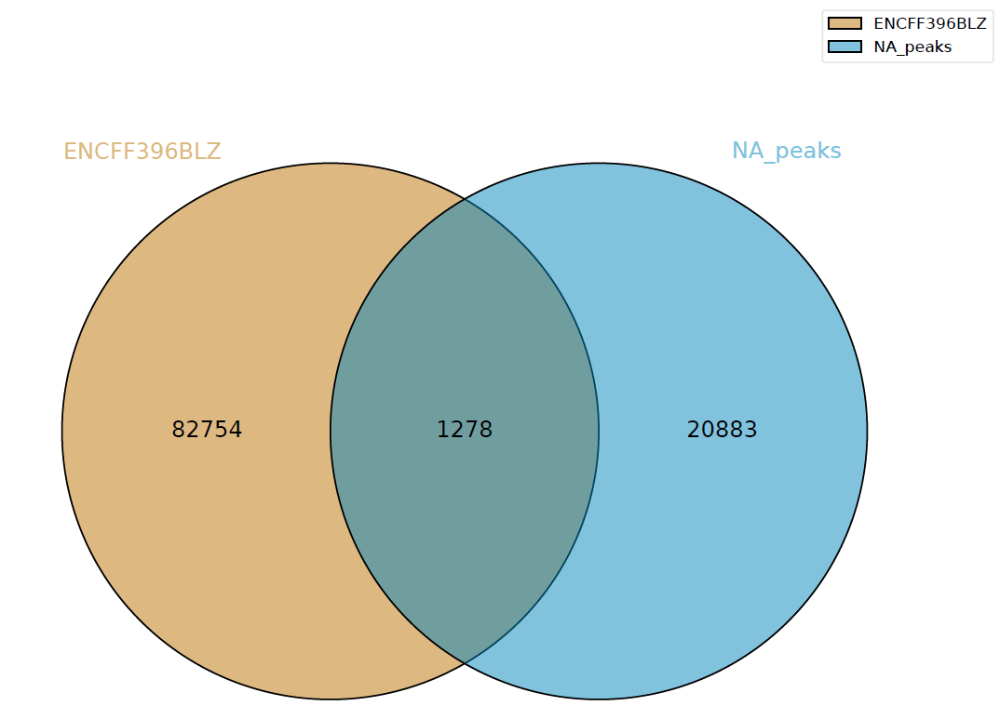
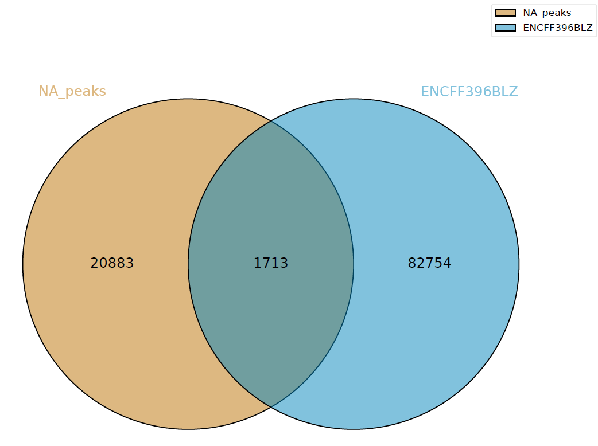

# hse_hw2_chip

ссылка на Google Collab: https://colab.research.google.com/drive/1mx_WY6o8S0V7dMnHCPv4hJ568b2dlm_V?usp=sharing

## Основная часть

### Дано:

Клеточная линия: Panc1

Гистоновая метка: H3K27ac

Реплика 1:ENCFF000VJD

Реплика 2: ENCFF000VJH

Контроль: ENCFF000VJK

### Анализ выдачи fastqc:

#### Анализ ENCFF000VJD:
В отчетё имеется следующие предупреждения:
1) Per tile sequence quality
2) Per base sequence content
3) Per sequence GC content

Перечисленные предупреждения не являются критичными, следовательно с данным файлом ничего дополнительно делать не надо.
________________

#### Анализ ENCFF000VJH:
В отчетё имеется следующие предупреждения:
1) Per base sequence content
2) Per sequence GC content

В В отчетё имеется следующие ошибки:
1) Per tile sequence quality

Несмотря на последнюю ошибку, главным проверочным параметром является Per base sequence quality, значения которого являются хорошими и следовательно можно не менять данный файл.
________________

#### Анализ ENCFF000VJK:

В отчетё имеется следующие предупреждения:
1) Per sequence GC content

Документ не требует изменения.

### Вывод: изменения файлов не требуется

### Анализ выдачи bowtie

### Диаграммы Венна 

Анализ полученных результатов. 
Как можно заметить, количество пересечений разное.

## Бонусная часть
